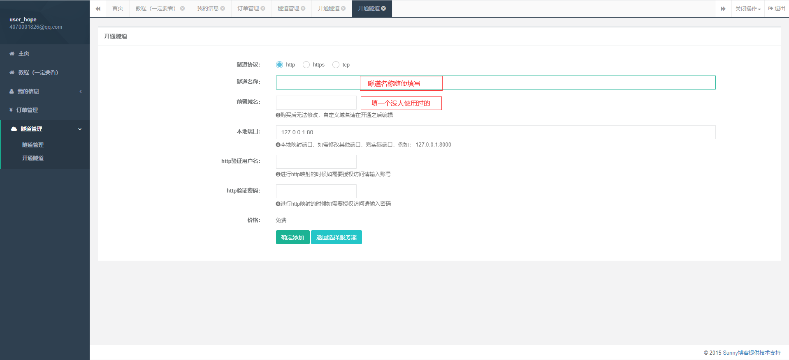
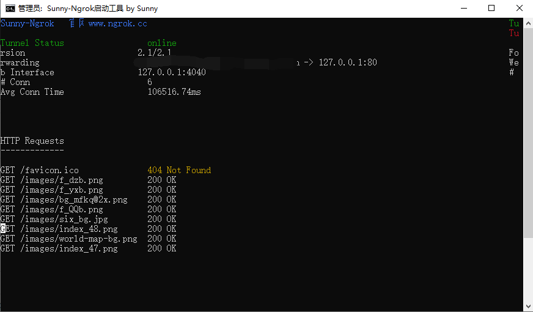
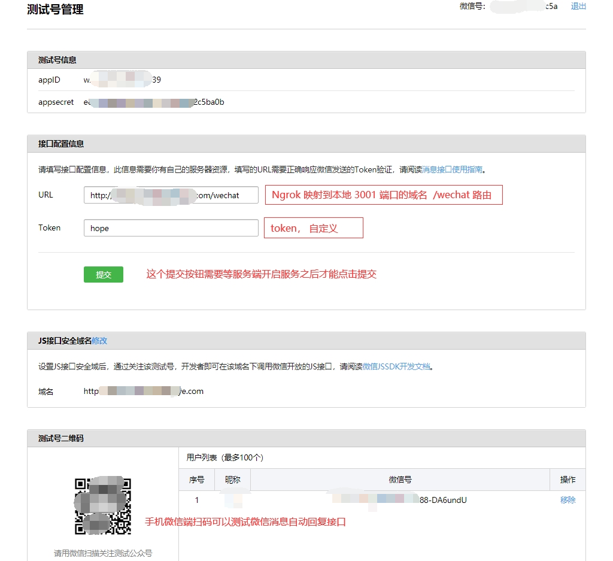
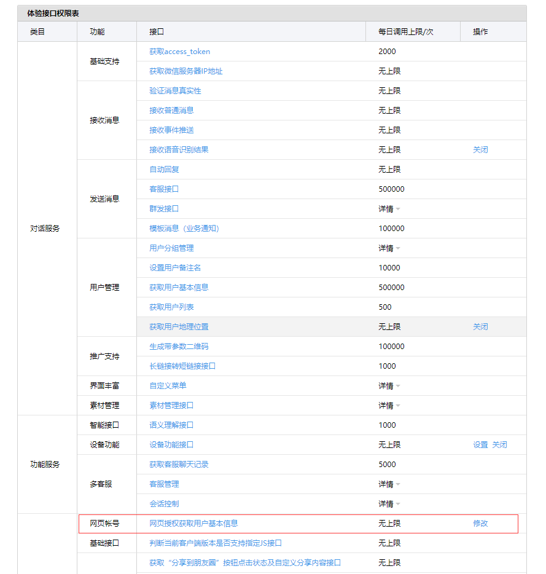
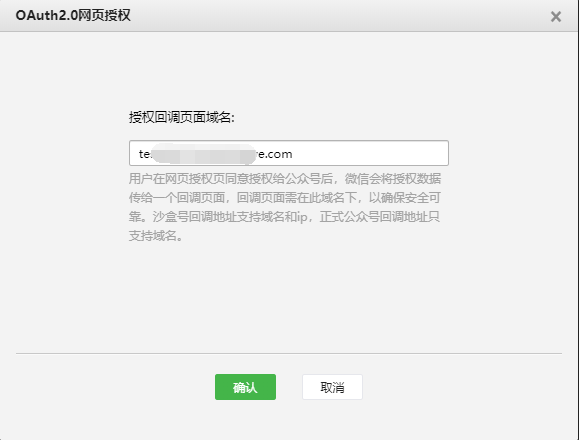
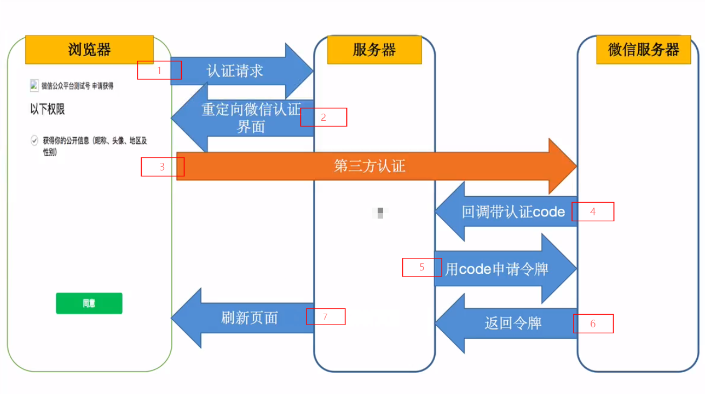
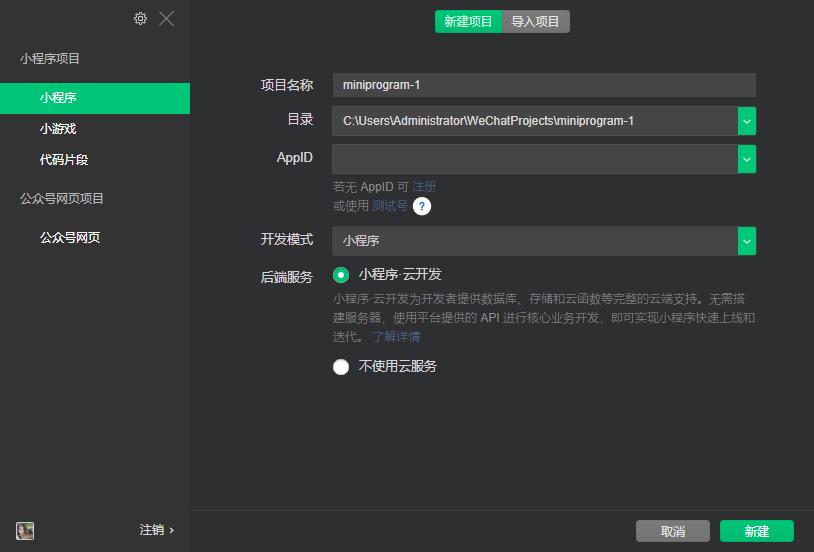
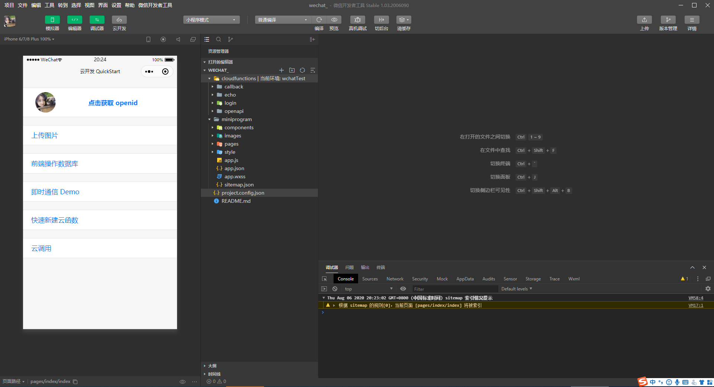
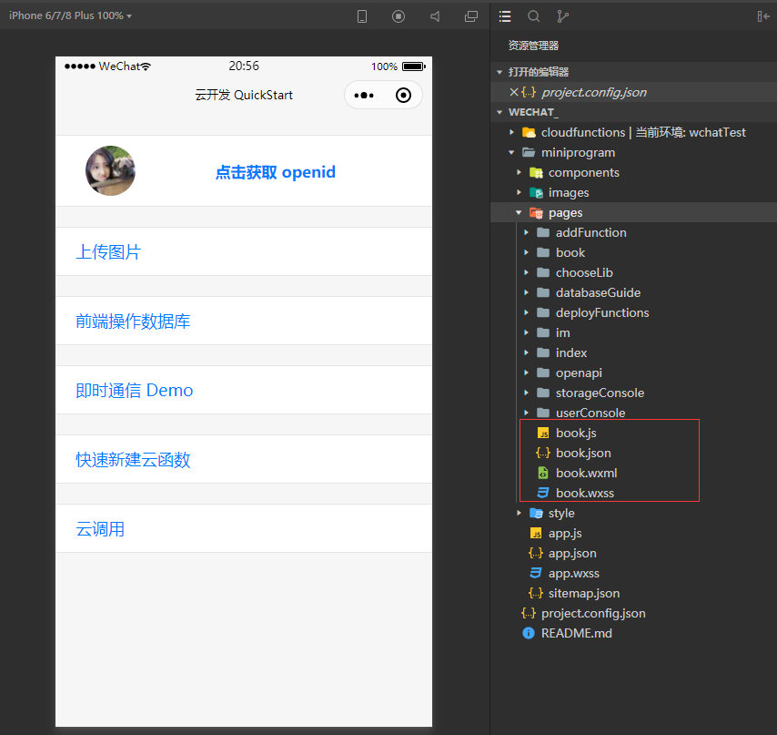
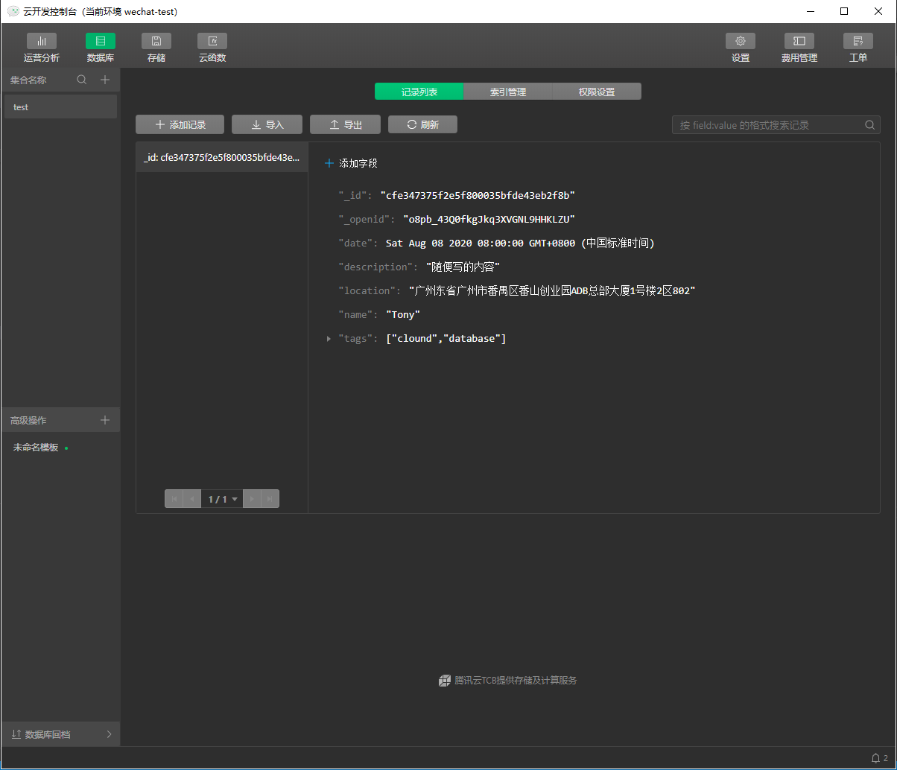

### 微信公众号

#### 公众号开发准备

[微信开放平台开发文档](https://developers.weixin.qq.com/doc/)

- 注册微信订阅号
- 注册小程序测试号
- sunny-ngrok 工具安装及注册账号
- 模拟公网ip, 有三种方式:
 - 申请一台阿里云 ECS
 - 公司网络有一个公网 ip 路由器端口映射
 - ngrok 内网穿透 tunnel

#### Ngrok 环境搭建

[Ngrok 的使用教程](http://www.ngrok.cc/_book/start/ngrok_windows.html)

- 1. 打开 [Ngrok 官网](https://www.ngrok.cc/) 申请一个账号并登陆;
- 2. 点击隧道管理, 打开通道, 选择一个免费版的隧道, 点击立即购买;
- 3. 编辑隧道信息 -- 填入隧道名(随便填写), 前置域名(例如 www.abc.baidu.com 中的 abc, 其实就是在该域名下面开了个前缀, 只要写前缀就行, 选一个别人没用过的), 本地映射的端口则是要和 web 项目的 http 端口对应;



- 4. 确定添加并启用, 到隧道管理页面可以看到刚刚添加成功的隧道, 复制隧道 id;


- 5. 启动 ngrok, 在窗口粘贴管理页面的隧道 id, 按 enter 键;


- 6. 启动之后的界面如下, 本地的 80 端口被映射到外网 ip 上, 访问 `127.0.0.1:4040` 可以看到访问日志;



### 公众号 - 服务器端

#### 开发环境搭建

- 1. 将 ngrok 打开, 通道映射到 `127.0.0.1:3001` 端口;

- 2. 初始化 `Koa` 项目(参照 Node 那篇 Koa 实例);
  
  ```bash
  # 安装 wechat 库
  npm install co-wechat
  ```
  [co-wechat 文档](https://github.com/node-webot/co-wechat)
  
- 3. 开通公众号测试账号: 通过公众号管理平台  -->  开发者工具  --> 公众号测试平台




- 4. 简易消息自动回复功能, 服务端编码:
  
  ```javascript
    // config.js
    module.exports = {
        appid:"wxc42a9674899c4f39",
        appsecret:"e8124e2ad4ed96a9119dda6bf2c5ba0b",
        token:"hope"
    }

    // app.js
    const Koa = require("koa");
    const Router = require("koa-router");
    const static = require("koa-static");
    const bodyparser = require("koa-bodyparser");
    const config = require("./config");
    const wechat = require("co-wechat");
    const app = new Koa();
    const router = new Router();

    router.all('/wechat',wechat(config).middleware(
        async message =>{
            console.log("message",message);
            return "Hello Wechat" + message.Content;
        }
    ))

    app.use(bodyparser());
    app.use(static(__dirname + '/'));
    app.use(router.routes());
    app.use(router.allowedMethods());

    app.listen(3001);
  ```
搭建完成之后启动服务, 然后在微信公众号平台 " 接口配置信息 " 点一下提交, 如果能正确提交就说明接口测试成功, 这个时候用手机微信端扫一下二维码就可以测试消息自动回复了;

#### 服务端 api 接口调用

这里为了方便测试微信的其他接口, 可以在服务目录下新建一个 `index.html`：

```html
<!DOCTYPE html>
<html lang="en">
<head>
    <meta charset="UTF-8">
    <meta name="viewport" content="width=device-width, initial-scale=1.0">
    <title>Document</title>

    <script src="https://cdn.staticfile.org/vue/2.6.0/vue.min.js"></script>
    <script src="https://cdn.staticfile.org/axios/0.20.0-0/axios.min.js"></script>

    <link rel="stylesheet" href="https://unpkg.com/element-ui/lib/theme-chalk/index.css">
    <script src="https://unpkg.com/element-ui/lib/index.js"></script>
</head>
<body>
    <div id="app">
        <el-button @click="getToken">getToken</el-button>
    </div>
    <script>
        var $vue = new Vue({
            el:"#app",
            mounted(){
                console.log(123);
            },
            methods:{
                async getToken(){
                    const res = await axios.get('/getToken');
                    console.log(res);
                }
            }
        })
    </script>
</body>
</html>
```
点击按钮来获取微信公众号的 token;  [微信公众号 api](https://developers.weixin.qq.com/doc/offiaccount/Basic_Information/Get_access_token.html), 服务端:

```javascript
const Koa = require("koa");
const Router = require("koa-router");
const static = require("koa-static");
const bodyparser = require("koa-bodyparser");
const config = require("./config");
const wechat = require("co-wechat");
const { default: axios } = require("axios");
const app = new Koa();
const router = new Router();

router.all('/wechat',wechat(config).middleware(
    async message =>{
        console.log("message",message);
        return "Hello Wechat" + message.Content;
    }
))

/**
 * 获取token 这里把 token 存储一下, 后面所有的 api 几乎都需要 token
 */
const TokenCache = {
    access_token : "",
    updateTime: Date.now(),
    expires_in: 7200
}
router.get('/getToken',async ctx =>{
    const url = `https://api.weixin.qq.com/cgi-bin/token?grant_type=client_credential&appid=${config.appid}&secret=${config.appsecret}`;
    const res = await axios.get(url);

    Object.assign(TokenCache,res.data,{
        updateTime:Date.now()
    })
    
    ctx.body = TokenCache;
})


app.use(bodyparser());
app.use(static(__dirname + '/'));
app.use(router.routes());
app.use(router.allowedMethods());

app.listen(3001);
```
但我们调用 api 每次重新启动服务都需要去获取 token 才能做后面的操作, 而微信的 token 接口每天只有 2000 次的调用权限, 并且但我们调用其他的 api 接口的时候都需要去查开放平台的 api 地址, 这样很不方便; 

所以, 公众号也为我们提供了一个库 [`co-wechat-api`](https://github.com/node-webot/co-wechat-api); 这个库里面基本上把所有的公众号的 api 都封装了一遍, 使用时非常方便的;

```bash
npm install co-wechat-api
```

服务端修改如下:

```javascript
const Koa = require("koa");
const Router = require("koa-router");
const static = require("koa-static");
const bodyparser = require("koa-bodyparser");
const config = require("./config");
const wechat = require("co-wechat");
const { default: axios } = require("axios");
const app = new Koa();
const router = new Router();

router.all('/wechat',wechat(config).middleware(
    async message =>{
        console.log("message",message);
        return "Hello Wechat" + message.Content;
    }
))

const WechatApi = require("co-wechat-api");
const api = new WechatApi(config.appid,config.appsecret);

/*
 * 获取用户列表, 不需要传递 token;
 */
router.get('/getUserList', async ctx =>{
    ctx.body = await api.getFollowers();
})


app.use(bodyparser());
app.use(static(__dirname + '/'));
app.use(router.routes());
app.use(router.allowedMethods());

app.listen(3001);
```

#### 多进程下 token 票据保存
当服务器开启多进程或者是集群的时候, `co-wechat-api` 就只能从当前运行环境里面获取 token , 这个时候我们就需要将 token 做一个全局的存储, 保证其他进程也能够获取到;

```javascript
// mongoose.js
const Mongoose = require("mongoose");
const { Schema } = Mongoose;
Mongoose.connect("mongodb://localhost:27017/weixin",{
    useNewUrlParser:true
},()=>{ console.log("Mongoose connect") });


exports.serverToken = Mongoose.model("ServerToken",{
    accessToken: String
})


// app.js
//...
const { serverToken } = require("./mongoose");
const WechatApi = require("co-wechat-api");
// 后面两个参数就是 token 的 get 和 set 方法
const api = new WechatApi(config.appid,config.appsecret,
    async function(){
        return await serverToken.findOne();
    }, 
    async function(token){
        // upsert 表示如果数据库里面没有这个字段的时候就插入, 有就是更新;
        const res = await serverToken.updateOne({},token,{ upsert:true });
    }
);

console.log(api);
router.get('/getUserList', async ctx =>{
    ctx.body = await api.getFollowers();
})

//...
```

### 微信 JSSDK - 网页版

[JS-SDK 文档](https://developers.weixin.qq.com/doc/offiaccount/OA_Web_Apps/JS-SDK.html)

实际上就是让开发者在网页上通过 javascript 代码使用微信原生功能的工具包, 开发者可以使用它在网页上录制和播放音频, 微信分享, 拍照等功能;

首先, 客户端我们得需要引用微信的 `JS-SDK` 插件, 在调用微信的功能之前, 还需要先获取 js-sdk 的 config;

```html
<!-- 客户端 -- 网页  -->

<script src="http://res.wx.qq.com/open/js/jweixin-1.6.0.js"></script>

<body>
    <div id="app">
        <el-button @click="getToken">getToken</el-button>
        <el-button @click="getUserList">getUserList</el-button>
        <el-button @click="getJsConfig">getJsConfig</el-button>
    </div>
    <script>
        var $vue = new Vue({
            el:"#app",
            methods:{
                async getToken(){
                    const res = await axios.get('/getToken');
                    console.log(res);
                },
                async getUserList(){
                    const res = await axios.get('/getUserList');
                    console.log(res);
                },
                async getJsConfig(){
                    const res = await axios.get('/getJsConfig',{
                        params:{
                            url: window.location.href
                        }
                    });
                    // 依赖是按需加载的, 需要使用哪个 api 功能就传哪个进去
                    res.data.jsApiList = [];
                    // 微信认证
                    wx.config(res.data);
                    wx.ready(function(){
                        console.log("wx.ready");

                    })
                    // 获取网络地址
                    wx.getNetworkType({
                        success:function(res){
                            console.log("NetworkType",res.networkType);
                        }
                    })
                }
            }
        })
    </script>
</body>
```

```javascript
// app.js  -- 服务端

//...
/**
 * 验证签名, 获取 jsconfig 
 */
router.get('/getJsConfig', async ctx =>{
    const res = await api.getJsConfig(ctx.query);
    ctx.body = res;
})
```
这里对网页进行调试的时候, 推荐使用微信的开发者工具, 打开开发者工具之后直接访问 ngrok 映射的域名就可以进行调试了;

#### 网页授权

[OAuth 2.0 原理](http://www.ruanyifeng.com/blog/2014/05/oauth_2_0.html)

微信的网络授权, 其实就是 `OAuth 2.0` 认证, 实例请查看 [github OAuth 开放授权](/docs/WebServer/Node/index?id=oauth-开放授权);

首先, 我们需要去到微信[公众平台](https://mp.weixin.qq.com/debug/cgi-bin/sandboxinfo?action=showinfo&t=sandbox/index) 的体验接口权限表, 配置账号网页授权的回调地址:





+ 1. 网页端, 添加微信登录的按钮, 调用服务端微信登录的 api , 获取用户信息的按钮用来测试登录成功之后获取用户信息:

```html
<div id="app">
    <el-button @click="OAuth">微信登录</el-button>
    <el-button @click="getUserInfo">获取用户信息</el-button>
</div>

<!-- ... -->
<script>
    var $vue = new Vue({
        el:"#app",
        methods:{
            async getJsConfig(){
                const res = await axios.get('/getJsConfig',{
                    params:{
                        url: window.location.href
                    }
                });
                // 依赖是按需加载的, 需要使用哪个 api 功能就传哪个进去
                res.data.jsApiList = [];
                // 微信认证
                wx.config(res.data);
                wx.ready(function(){
                    console.log("wx.ready");

                })
                // 获取网络地址
                wx.getNetworkType({
                    success:function(res){
                        console.log("NetworkType",res.networkType);
                    }
                })
            },
            async OAuth(){
                window.location.href = '/wxAuthorize';
            },
            async getUserInfo(){
                const openId = SerializeUrl().openid;

                const res = await axios.get('/getUserInfo',{
                    params:{
                        openid:openId
                    }
                })
                console.log(res.data);
            }
        }
    })

    function SerializeUrl(){
        try {
            var url = window.location.href;
            var search = url.substring(url.lastIndexOf('?') + 1)
            if (!search) {
                return {}
            }
            return JSON.parse('{"' + decodeURIComponent(search).replace(/"/g, '\\"').replace(/&/g, '","').replace(/=/g, '":"') + '"}') 
        } catch (error) {
            return {}
        }       
    }
</script>
```
+ 2. 服务端实现 `/wxAuthorize` 的接口;

首先, 需要安装微信的 `co-wechat-oauth` 模块;

```bash
npm install co-wechat-oauth
```

```javascript
/**
 * 生成用户点击登录时候的 url, 导向到微信登录授权界面
 */
const OAuth = require("co-wechat-oauth");
const oauth = new OAuth(config.appid,config.appsecret);

router.get('/wxAuthorize', async ctx=>{
    const state = ctx.query.id;
    console.log("ctx...",ctx.href);
    let redirectUrl = ctx.href;
    redirectUrl = redirectUrl.replace('wxAuthorize','wxCallback');
    const scope = "snsapi_userinfo";

    const url = oauth.getAuthorizeURL(redirectUrl,state,scope);
    console.log("url",url);
    ctx.redirect(url);
})


/**
 * 获取用户回调 accessToken 和 Openid
 */
router.get('/wxCallback', async ctx =>{
    // 授权码
    const code = ctx.query.code;
    console.log("getAccessCode",code);

    const token = await oauth.getAccessToken(code);
    const accessToken = token.data.access_token;
    const openid = token.data.openid;

    ctx.redirect('/?openid=' + openid);
})

/**
 * 获取用户信息 
 */
router.get('/getUserInfo',async ctx =>{
    const openid = ctx.query.openid;
    const userInfo = await oauth.getUser(openid);
    ctx.body = userInfo;
})
```
当前端点击微信登录按钮的时候, 浏览器向服务器发起一个认证请求, 服务端将请求重定向到微信登录认证的界面, 用户点击同意登录的按钮之后, 浏览器就会向微信服务器发起一个第三方认证, 由微信服务器进行认证, 认证成功以后会向我们的服务器回调一个带有认证信息的 code(授权码), 服务器收到授权码之后, 会再一次向微信服务器发送一个 ajax 请求(携带 code 申请令牌), 微信服务器接收到令牌校验成功之后, 会将令牌返回到我们的服务器, 这个时候我们的服务器就会刷新前端的页面;



#### token 存储
和前面的公众号存储 token 一样, 可以使用 `mongodb` 来存储用户 token, 不同的是这里可能会有很多个用户, 对 `mongodb` 的 `schma` 设计其实就是将微信返回的信息全都写入进去:

```javascript
// mongoose.js
const Mongoose = require("mongoose");
const { Schema } = Mongoose;
Mongoose.connect("mongodb://localhost:27017/weixin",{
    useNewUrlParser:true
},()=>{ console.log("Mongoose connect") });


exports.serverToken = Mongoose.model("ServerToken",{
    accessToken: String
})

// ClientAccessToken
const schema = new Schema({
    access_token:String,
    expires:Number,
    refresh_token:String,
    openid:String,
    scope:String,
    create_at:String
})

// 构建两个静态的方法, 取值
schema.statics.getToken = async function (openid){
    return await this.findOne({ openid: openid });
}

// 存值
schema.statics.setToken = async function (openid,token){
    const query = {
        openid:openid
    }
    const options = {
        upsert:true
    }
    return await this.updateOne(query,token,options);
}

exports.clientToken = Mongoose.model("clientToken",schema);
```
修改 `app.js` 的 auth 配置：

```javascript
/**
 * 生成用户点击登录时候的 url, 导向到微信登录授权界面
 */
const OAuth = require("co-wechat-oauth");
const oauth = new OAuth(config.appid,config.appsecret,
    async function(openid){
        return await clientToken.getToken(openid);
    },
    async function(openid,token){
        return await clientToken.setToken(openid,token);
    }
);

router.get('/wxAuthorize', async ctx=>{
    const state = ctx.query.id;
    console.log("ctx...",ctx.href);
    let redirectUrl = ctx.href;
    redirectUrl = redirectUrl.replace('wxAuthorize','wxCallback');
    const scope = "snsapi_userinfo";

    const url = oauth.getAuthorizeURL(redirectUrl,state,scope);
    console.log("url",url);
    ctx.redirect(url);
})
```

### 微信小程序

[小程序官方文档](https://developers.weixin.qq.com/miniprogram/dev/reference/)

#### 开发环境

首先, 我们需要在开放平台上注册一个小程序账号, [微信开放平台]( https://mp.weixin.qq.com/);

[微信开发者工具](https://developers.weixin.qq.com/miniprogram/dev/devtools/download.html)

小程序的开发环境其实也就是用微信官方提供的开发工具, 安装成功之后直接打开就可以使用, 非常的便捷;

开发者工具支持小程序, 小游戏和公众号网页开发; 初始化小程序工程也是比较简单的, 直接点击新建就可以;



初始化后的项目结构如下:



#### 目录结构

其中, `miniprogram` 是小程序的前端工程, `cloudfunctions` 是云开发环境, 其实就是一个 node 的服务;  (后面会详细的说明一下云开发模式) ;

- `components`      小程序组件
- `images`          小程序依赖的图片资源
- `pages`           页面
- `styles`          样式文件
- `app.js`          小程序入口文件 
- `app.json`        小程序全局配置, 页面路由, 窗口表现, 网络超时, tab 等
- `app.wxss`        全局样式, 类似在 vue 项目的 main.js 里面引入了一个公用的 css 文件
- `sitemap.json`    配置小程序及其页面是否允许被微信索引

一个小程序页面由四个文件组成：

- `.js`             页面逻辑层
- `.wxml`           视图, 类似 vue 开发的 template
- `.json`           当前页面的页面配置
- `.wxss`           当前页面的 css 样式

例如, 当我们在 `page` 里面新建一个 `book` 页面的时候, 开发者工具会给我们自己生成 `book.js`, `book.json`, `book.wxml`, `book.wxss`;



#### 组件

[微信小程序组件](https://developers.weixin.qq.com/miniprogram/dev/component/)

微信官方为开发者定制了许多组件, 给组件上添加属性就能实现一些简单的功能, 使开发非常便捷; 简单到添加一个按钮就可以实现微信客服的功能:

```html
<view>
    <button type="primary" open-type="contact">客服</button>
</view>
```
给按钮添加上 `open-type='contact'` 属性, 就可以直接使用微信开放功能里面的客服功能, 直接唤起微信客服聊天系统;

除了常用的 `button`, `input` 等页面元素组件外, 小程序还提供了一些原生组件, 使用原生组件, 我们可以很简单的使用手机的硬件功能, 例如 `camera`, `video`组件等;

下面几行代码展示了小程序调用手机相机拍照的功能: 拍完照片之后小程序会生成一个临时的图片链接;

```html
<view>
    <!-- `device-position` 允许我们默认打开的摄像头的位置是前置摄像头还是后置;   -->
    <camera device-position="front" style="width: 100%;height: 300px;"></camera>
    <button type="primary" bindtap="takePhoto">拍照</button>
    <image mode="widthFix" src="{{src}}"></image>
</view>
```
```javascript
Page({
    data:{
        src:""
    },
    takePhoto(){
        let ctx = wx.createCameraContext();
        ctx.takePhoto({
            success:res=>{
                this.setData({
                    src:res.tempImagePath
                })
            }
        })
    }
})
```
小程序的语法有点类似 `vue` 和 `react`, data 属性里面放的是初始化数据, 通过 `setData` 进行修改 `data` 的数据;

#### 云开发

> 注意: 云开发模式需要在小程序的入口文件 `app.js` 里面指定开发环境;

```javascript
App({
    onLaunch: function () {
        if (!wx.cloud) {
            console.error('请使用 2.2.3 或以上的基础库以使用云能力')
        } else {
            wx.cloud.init({
                // env 参数说明：
                //   env 参数决定接下来小程序发起的云开发调用（wx.cloud.xxx）会默认请求到哪个云环境的资源
                //   此处请填入环境 ID, 环境 ID 可打开云控制台查看
                //   如不填则使用默认环境（第一个创建的环境）
                env: 'wechat-test',
                traceUser: true,
            })
        }
        this.globalData = {}
    }
})
```

[小程序云开发](https://developers.weixin.qq.com/miniprogram/dev/wxcloud/basis/getting-started.html)

即开发者可以使用云开发来开发微信小程序, 小游戏, 无需搭建服务器即可拥有云端的能力;

云开发为开发者提供完整的原生端的支持和微信服务支持, 弱化后端和运维概念, 无需搭建服务器, 使用平台提供的 api 进行核心业务开发, 即可以实现快速上线和迭代;

`cloudfunctions` 云函数, 是基于 NodeJs 的开发环境, 一个云函数等于一个 NodeJs 的模块(项目); 开发者可以在云函数里面安装 npm 模块;

下面通过一个简单的查询案例来了解一下云函数的使用:

`cloudfunctions` 目录下面右键 -->  新建 Nodejs 云函数 (这里需要注意的是云函数不能重名, 只能有一个唯一名称存在 `cloudfunctions` 目录下) -->  新建一个 serch 的云函数;

新建完成之后可以看到目录下面有 3 个文件:

- `config.json`
- `index.js`            云函数入口文件
- `package.json`        项目依赖管理, 和 node 的开发环境一样, 也可以自己安装第三方模块

```javascript
// 云函数入口文件
const cloud = require('wx-server-sdk')

cloud.init()

// 云函数入口函数
exports.main = async (event, context) => {
    const wxContext = cloud.getWXContext()

    return {
        event,
        openid: wxContext.OPENID,
        appid: wxContext.APPID,
        unionid: wxContext.UNIONID,
    }
}
```
云函数的传入参数有两个, 一个是 `event` 对象, 一个是 `context` 对象. `event` 指的是触发云函数的事件, 当小程序端调用云函数时, `event` 就是小程序端调用云函数时传入的参数, 外加后端自动注入的小程序用户的 `openid` 和小程序的 appid. `context` 对象包含了此处调用的调用信息和运行状态, 可以用它来了解服务运行的情况;

```html
<!-- serch.wxml -->
<view class="page-section">
    <view class="weui-cells weui-cells_after-title">
		<view class="weui-cell weui-cell_input">
			<input class="weui-input" maxlength="10" placeholder="最大输入长度为10" bindinput="keyInput"/>
		</view>
	</view>
    <view class="weui-cells weui-cells_after-title" style="margin-bottom:15px"></view>
    <button type="primary" bindtap="handleSerch" style="width:80%">查询结果</button>
</view>
```
```javascript  
// miniprogram  serch.js
Page({
    /**
     * 页面的初始数据
     */
    data: {
        name:"",
    },
    keyInput(e){
        this.setData({
            name:e.detail.value
        })
    },
    handleSerch(){
        wx.cloud.callFunction({
            name:"serch",
            data:{
                name:this.data.name
            },  
            success: res=>{
                console.log(res);
            }
        })
    }
})
```
```javascript  
// cloudfunctions  serch/index.js

const cloud = require('wx-server-sdk');
const axios = require('axios');
cloud.init()

// 云函数入口函数
exports.main = async (event, context) => {
    const { name } = event; 
    const res = await axios.get(`https://sp0.baidu.com/9_Q4sjW91Qh3otqbppnN2DJv/pae/common/api/yaohao?name=${name}&city=%E5%B9%BF%E5%B7%9E&format=json&resource_id=4003`);
    return res.data;
}
```
当点击计算按钮的时候, 会执行 `wx.cloud.callFunction` 调用云函数, `name` 字段为调用的云函数名, `data` 表示需要向云函数传递的参数, 调用成功之后会执行 `success` 回调;

云函数 `serch` 的 `event` 为前端传过去的 `data` 参数, 结构出参数里面的 `name` 字段, 然后通过 `axios`请求一个第三方接口, 把结果返回给小程序前端;

> 需要注意的是, 云函数开发完成之后需要上传并部署才能使用;


#### 云数据库

[云存储 database](https://developers.weixin.qq.com/miniprogram/dev/wxcloud/reference-sdk-api/Cloud.database.html)

小程序云开发还给开发者提供了云存储服务, 开发者工具  -->  云开发  -->  数据库; 小程序的云数据库和 `mongoodb` 的数据结构类似, 都是以键值的方式进行存储的; 

需要用到数据库的地方, 直接调用 `wx.cloud.database` 即可使用; 直接在小程序前端使用:

```javascript
const db = wx.cloud.database();

Page({
    data:{
        name:""
    },
    keyInput(e){
        this.setData({
            name:e.detail.value
        })
    },
    handleClick(){
        db.collection("test").add({
            data:{
                description:"随便写的内容",
                date:new Date("2020-08-08"),
                tags:[
                    "clound",
                    "database"
                ],
                name:this.data.name,
                location:"广州东省广州市番禺区番山创业园ADB总部大厦1号楼2区802"
            }
        }).then(res =>{
            console.log(res);
        })
    }
})
```
当用户点击按钮的时候, 就会向 `test` 云数据库里面插入一条记录, 这个时候我们再打开  云开发 -->  数据库;  就可以看到插入进来的数据了;




### Taro

[Taro 官方文档](https://taro.aotu.io/)

Taro 是一个使用 `React` 框架来开发小程序的开源项目, 


